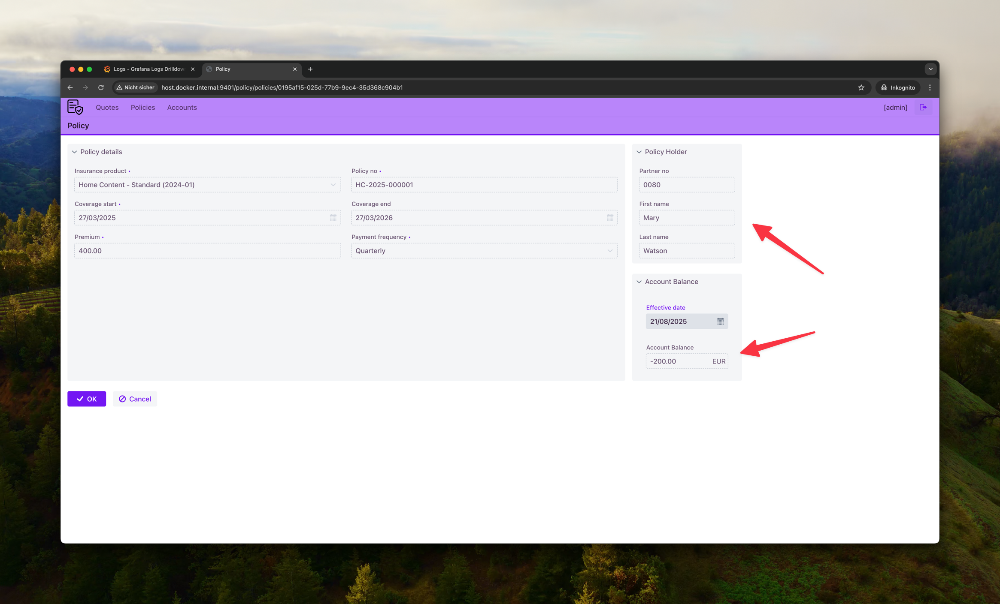
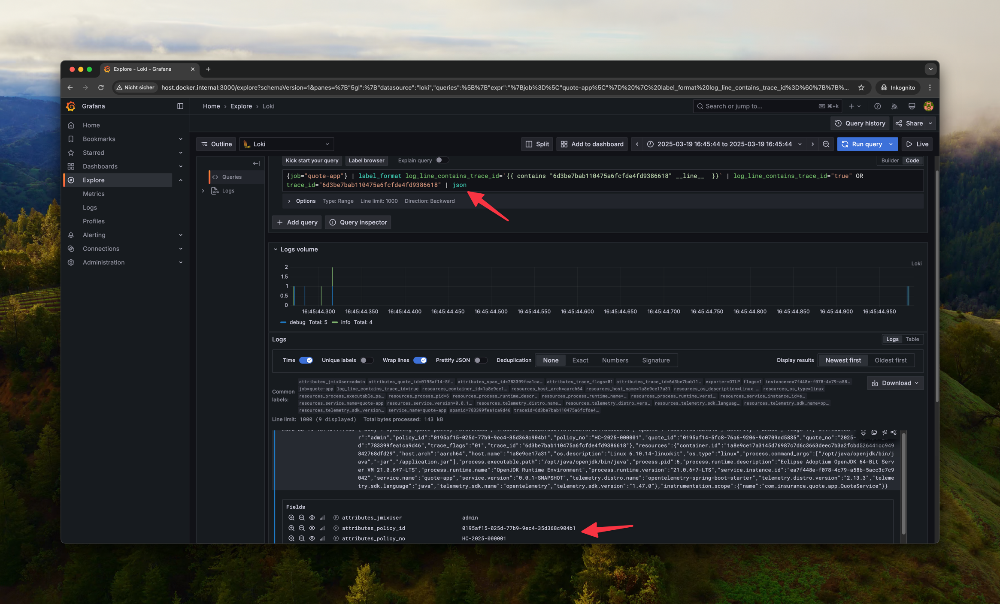

1. **Creating a Quote and Checking UI Functionality**
  - Create a quote in the Quote application, search for a partner, and save the quote
  - Accept the quote, triggering the flow and switching to the Policy application
  - Check the account balance to verify interaction with the Account API

2. **Structured Logging in Grafana**
  - Open logs in Grafana
  - Check logs from the Quote application (e.g., "Trying-to-Accept-Quote")
  - Analyze structured log entries (body, level, job, MDC values such as Quote ID)
  - Use the show field option to display details
  - Explanation: OpenTelemetry configuration for Logback sends logs to backends
  - MDC enables structured logs without explicitly writing the Quote ID
  - Filter and analyze logs in Grafana

3. **Centralized Logging in Grafana with Loki Queries**
  - Navigate to the Grafana Explore section
  - Select the Loki data source
  - Use the search button for `attributes_quote_id`
  - Apply the automatically generated filter
  - Open a log entry and use the eye icon to display the body details
  - Advantage: Filtering logs across multiple applications using MDC values
  - Reminder: Loki is not a full-text search engine, so additional attribute filtering is necessary

4. **Connecting Logs to Traces with Distributed Tracing**
  - Open a log entry and check `TraceID` and `SpanID` under attributes
  - Explanation: MDC values are not always sufficient, as not all applications use the same Quote ID
  - `TraceID` and `SpanID` enable distributed tracking across system boundaries
  - Scroll down and click on the Tempo link under `TraceID`
  - Tempo opens the full trace view
  - Analyze the trace view to see the entire process across different systems

5. **Trace Analysis and Auto-Instrumentation**
  - Analyze the flame graph in the trace view
  - The visualization shows the total duration of the business operation (e.g., accepting a quote)
  - Different colors represent different applications (Quote app, Policy app, Account app)
  - Sub-elements display the breakdown of operations and the services involved
  - Auto-instrumentation captures traces automatically without additional code changes
  - Expand a span (e.g., POST from Quote app to Policy app)
  - Different span types:
    - DB spans show `DB Name`, `DB SQL Table`, `DB Statement` (e.g., `INSERT INTO Policy`)
    - HTTP spans show `http.method`, `http.url`, `http.status_code`
  - Auto-instrumentation automatically fills attributes, visible under `Library Name` (e.g., `io.opentelemetry.jdbc`)

6. **Filtering and Analyzing Logs from Traces**
  - Open a span (e.g., `Accept Quote`)
  - Use the `Logs for this Span` button to retrieve related logs
  - Collapse the trace view and analyze the logs
  - Activate JSON parsing and filter logs by attributes:
    ```loki
    {job="quote-app"} | label_format log_line_contains_trace_id=`{{ contains "6d3be7bab110475a6fcfde4fd9386618" __line__  }}` | log_line_contains_trace_id="true" OR trace_id="6d3be7bab110475a6fcfde4fd9386618"
    ```
  - Extended JSON analysis to display all attributes:
    ```loki
    {job="quote-app"} | label_format log_line_contains_trace_id=`{{ contains "6d3be7bab110475a6fcfde4fd9386618" __line__  }}` | log_line_contains_trace_id="true" OR trace_id="6d3be7bab110475a6fcfde4fd9386618" | json
    ```
    
  - Filter logs based on spans and traces

7. **Exception Handling and Debugging with Traces**
  - Open a policy and navigate to the detailed view 
  - Select an account balance with a future date (e.g., 2029)
  - Go to Grafana and search for the TraceID
  - Examine the error details and stack trace in the trace view


* Metrics (?)