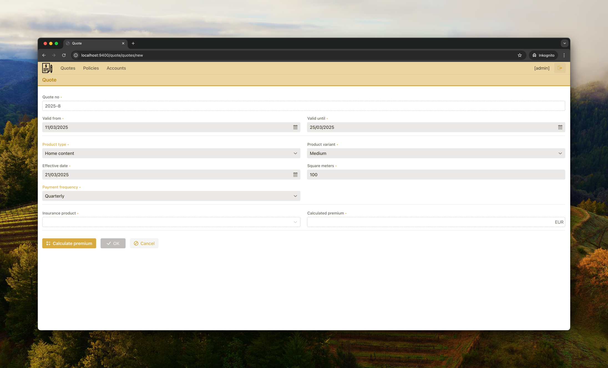

# Insurance Observability

## Overview

Insurance Observability is an evaluation project that explores different Observability implementations in the Java ecosystem. The goal is to understand how various tools and frameworks—such as OpenTelemetry, Micrometer, and different logging and tracing solutions—can be integrated into Spring boot applications.

### Application Flow


1. The Quote App allows users to create insurance quotes. Once the quote is accepted by the users, the application sends an HTTP request to the Policy App, which issues the corresponding policy. 
2. If the policy creation is successful, a message is sent to the "policy-created" Kafka topic. 
3. The Account App listens for this event and generates booking records. 

### Key Topics Covered

* Tracing, Logging, and Metrics: Differences and use cases
* Comparison of OpenTelemetry and Micrometer Tracing
* Instrumentation strategies: Manual vs. automatic instrumentation

### Observability Deployment


### Observability Stack

In this example we use the Grafana Stack for observability, which includes:

- Loki for log aggregation
- Prometheus for metrics collection
- Tempo for distributed tracing

Grafana provides a unified dashboard to visualize logs, metrics, and traces, enabling efficient monitoring and troubleshooting.

This observability stack acts as an example for showcasing observability functionality. The applications are not directly tied to a particular observability stack by leveraging the Open-Telemetry protocol and the Open-Telemetry collector.

#### Open Telemetry Collector

All telemetry data flows through the OpenTelemetry Collector, which acts as an intermediary between applications and the backend observability systems.

- Logs from applications are sent to Loki.
- Metrics are collected using Prometheus.
- Traces are processed and stored in Tempo.

Alternatively, applications can send telemetry data directly to the observability backend without using the OpenTelemetry Collector, depending on the specific requirements and infrastructure.

By using the OpenTelemetry Collector, we gain the flexibility to send telemetry data to any backend that supports the OTLP protocol, including services like Datadog, Splunk, Honeycomb, and many others. See also: https://opentelemetry.io/ecosystem/vendors/.

### Getting Started

#### Prerequisites

* Java 21+
* Docker and Docker Compose (for running backend services)

#### Running the Project

#### 0. host.docker.internal

Ensure you have `host.docker.internal` pointed to 127.0.0.1:

```shell
echo "127.0.0.1 host.docker.internal" | sudo tee -a /etc/hosts
```

#### 1. Docker containers

Spinning up the observability docker containers:

```shell
docker compose -f docker/docker-compose-infra.yaml -f docker/docker-compose-observability.yaml up -d
```

#### 2. Build application

```shell
./build.sh
```

#### 3. Start application

```shell
docker compose -f docker/docker-compose-apps.yaml up --build -d
```

#### 4. Open Apps

```shell
open http://host.docker.internal:9400/quote http://host.docker.internal:9401/policy http://host.docker.internal:9402/account
```

#### 5. Open Grafana

```shell
open http://host.docker.internal:3000
```

* Username: `admin`
* Password: `admin`

#### 6. Creating Random Quotes

```shell
watch -n 5 'curl -s -X POST --location http://host.docker.internal:9400/quote/api/quotes/random | jq'
```

## Application structure

This project follows a multi-module structure, where each application consists of:

- A Core Module (e.g., `quote-core`)
- An Application Module (e.g., `quote-app`)

Each module serves a specific purpose:

- Core Modules contain the domain entities, UI components, and business logic. They define the core structure of the application while minimizing infrastructural dependencies.
- Application Modules exist primarily to create a runnable application by integrating the corresponding `-core` module with infrastructure components. This includes dependencies for logging, tracing, and monitoring.

The reason for this separation is to clearly illustrate which dependencies are required at which level. For instance:
- The core module may only require annotation-based dependencies (e.g., `@WithSpan` from OpenTelemetry).
- The application module includes runtime dependencies, such as OpenTelemetry exporters and collectors.

This structure helps distinguish business logic from infrastructure concerns, ensuring a clean separation between the core application logic and its operational environment.


## Quote App

The Quote App allows users to create new insurance quotes. Users can calculate the premium and ultimately accept a quote. Once a quote is accepted, the Policy App is triggered to create a corresponding policy. The generated policy is then stored with a reference to the accepted quote.




### OTel Spring Boot Starter
In the Quote App, we use the [OpenTelemetry Spring Boot Starter](https://opentelemetry.io/docs/zero-code/java/spring-boot-starter/) to configure automatic OpenTelemetry instrumentation. This allows us to enable tracing without requiring the OpenTelemetry Java Agent.

#### Characteristics of the Approach

The advantages of using the Spring Boot Starter over the Java Agent include: 

- **Native Spring Boot support**: It integrates more seamlessly into the Spring ecosystem and allows configuration via standard `application.properties` or `application.yml` files.
- **Version Management**: The dependency version is managed through Maven or Gradle, ensuring compatibility with other Spring Boot components. In contrast, the Java Agent requires manual management, as it is downloaded separately and must be maintained outside of standard dependency management. This can complicate updates, especially in Docker environments where the agent JAR must be manually retrieved and included.
- **Potential compatibility issues with Spring updates**: Since OpenTelemetry provides its own instrumentation instead of relying on native Spring Boot hooks, there may be cases where a Spring version update is not immediately supported by OpenTelemetry. This can lead to temporary incompatibilities that require waiting for updates from the OpenTelemetry community.
- **Broad ecosystem support**: On the other hand, OpenTelemetry has a very broad ecosystem and supports a wide range of libraries beyond just Spring Boot. This makes it a versatile choice for observability across various Java frameworks and technologies.


### Automatic Instrumentation
We include the following dependency in the application (`quote-app`):

```gradle
implementation 'io.opentelemetry.instrumentation:opentelemetry-spring-boot-starter'
```

This provides automatic instrumentation for common libraries without the need to manually instrument anything (see also [OTel Spring Boot Starter - Out of the Box Instrumentation](https://opentelemetry.io/docs/zero-code/java/spring-boot-starter/out-of-the-box-instrumentation/))

The OpenTelemetry Spring Boot Starter includes support for:
- Traces: Automatic and manual span creation.
- Metrics: Capturing system and application metrics.
- Logging: Integration with Logback, adding a special OpenTelemetry appender.

The starter automatically configures Logback and enriches logs with tracing context, ensuring that traces, metrics, and logs are all correlated within the observability backend.

#### Disabling Specific Auto Instrumentation

For illustration purposes we want to disable certain automatic instrumentations provided by the OpenTelemetry Spring Boot Starter. This can be done using application properties. For example, to disable JDBC instrumentation:

```properties
otel.instrumentation.jdbc.enabled=false
```

#### Manual Custom Spans
Additionally, in `quote-core`, we include the following dependency for manual instrumentation:

```gradle
implementation 'io.opentelemetry.instrumentation:opentelemetry-instrumentation-annotations:1.27.0'
```

Using this dependency, we can annotate specific methods with `@WithSpan` to create custom spans, providing more granular tracing where needed.

##### Example: Creating a Custom Span

```java
import io.opentelemetry.instrumentation.annotations.WithSpan;
import org.springframework.stereotype.Service;

@Service
public class QuoteService {

    @WithSpan("Accept Quote") // [optional] creating a custom span for better visibility
    public Quote accept(Id<Quote> quoteId) {
        // ...
    }
}
```

see: [quote-core: Quote Service](quote-core/quote-core/src/main/java/com/insurance/quote/app/QuoteService.java)

Here, the `@WithSpan` annotation ensures that the `generateQuote` method is traced with its own span, making it easier to track its execution within OpenTelemetry.


##### Example: Creating a Span Programmatically

It is also possible to create spans can programmatically using OpenTelemetry's `Tracer` API, e.g. when trying to add custom span attributes.

```java
@Subscribe("quotesDataGrid.acceptAction")
public void onQuotesDataGridAcceptAction(final ActionPerformedEvent event) {
    
    Tracer tracer = openTelemetry.getTracer(QuoteListView.class.getName());
    Span span = tracer.spanBuilder("UI: accept quote action").startSpan();
    
    try {
        // ...
    }
    finally {
        span.end();
    }
}
```

see: [quote-core: Quote List View](quote-core/quote-core/src/main/java/com/insurance/quote/view/quote/QuoteListView.java)


## Policy App

The Policy App receives policy creation requests via an API. When a new policy is successfully created, it sends a notification to the `policy-created` Kafka topic. This ensures that other systems can react to the new policy event and process it accordingly.


### OTel Javaagent

The Policy App is instrumented using the [OpenTelemetry Java Agent](https://opentelemetry.io/docs/zero-code/java/agent/), which allows automatic instrumentation without requiring dependencies in the source code. Instead, the agent is attached at runtime and modifies the bytecode dynamically to inject instrumentation.

The agent automatically captures:

* Logs
* Metrics
* Traces

(same as for the Spring Boot Starter).

#### Characteristics of the Approach

The advantages of using the Java Agent include:

- **Zero Instrumentation Effort**: The Java Agent does not require any changes to the source code. It can be attached to applications even if you do not have control over their codebase.
- **No Custom Instrumentation**: The Java Agent provides automatic instrumentation but lacks flexibility for custom spans or fine-grained instrumentation.
- **Manual Version Management**: Unlike dependencies managed via Maven or Gradle, the Java Agent must be manually downloaded and maintained outside of standard dependency management. This makes updates more complex, particularly in Docker environments where the agent JAR must be manually retrieved and included.
- **Potential Compatibility Issues**: The Java Agent uses bytecode manipulation to instrument applications. As a result, updates to libraries or frameworks (e.g., Spring Boot) may introduce compatibility issues that require waiting for OpenTelemetry to release updated support.
- **Configuration via System Properties or Environment Variables**: Unlike the Spring Boot Starter, which allows configuration via `application.properties`, the Java Agent must be configured using system properties or environment variables, making it less integrated into the Spring ecosystem.

#### Configuration
To use the agent, the application needs to be started with the `-javaagent` flag:

```shell
CMD java -javaagent:/opentelemetry-javaagent.jar -jar /application.jar "$@"
```
see: [policy-app: Dockerfile](policy-app/Dockerfile)

Additionally, environment variables configure the behavior:

```shell
OTEL_SERVICE_NAME: policy-app
OTEL_LOGS_EXPORTER: otlp
OTEL_EXPORTER_OTLP_ENDPOINT: http://host.docker.internal:4318
OTEL_JAVAAGENT_DEBUG: false
OTEL_INSTRUMENTATION_LOGBACK_MDC_ENABLED: true
```
see: [docker/docker-compose-apps.yaml](docker/docker-compose-apps.yaml)


## Account App

The Account App listens for `policy-created` events from Kafka. It then retrieves the policy details from the Policy App via a REST API to determine the payment frequency. Based on this information, it creates accounting entries and calculates the effective dates for when these transactions become valid.


### Micrometer

The Account App uses Micrometer and Micrometer Tracing, which are built into Spring Boot Actuator. Instead of relying on OpenTelemetry's Java Agent or Spring Boot Starter, this approach uses Micrometer as the abstraction layer for tracing and metrics.

> Micrometer provides a facade for the most popular observability systems, allowing you to instrument your JVM-based application code without vendor lock-in. Think SLF4J, but for observability.

see: [Micrometer Website](https://micrometer.io/).


Using Micrometer through Spring Boot Actuator handles:

- Metrics (via Micrometer-OTLP-Registry)
- Tracing (via Micrometer-tracing-bridge-otel)

Logs require manual configuration via Logback, as Micrometer does not handle logging.

#### Characteristics of the Approach

The advantages of using Micrometer in the Account App include:
- **Native Spring Boot integration**: Micrometer is developed by the Spring team and is natively embedded in the Spring Boot ecosystem.
- **No compatibility issues with Spring updates**: Since Micrometer is part of the Spring ecosystem, it is automatically instrumented by all standard Spring Boot libraries, including Spring Security and Spring Web. This ensures that Micrometer remains compatible with Spring Boot updates without requiring adjustments.
- **Stable dependency management**: Micrometer is included as a standard Maven or Gradle dependency, meaning version updates are managed within the application’s dependency configuration without requiring external downloads.
- **Smaller library coverage**: While Micrometer provides strong support for Spring-based applications, its ecosystem coverage is slightly smaller than OpenTelemetry, which supports a broader range of frameworks and libraries beyond Spring.
- **Different Metric Naming Conventions**: Micrometer uses its own metric naming conventions, which can differ from the standardized OpenTelemetry metric names. This can lead to discrepancies when integrating with other OpenTelemetry-based observability tools, requiring additional mapping or adjustments.

### Dependencies
The following dependencies are used in the Account App:

#### Actuator & Micrometer Core
Spring Boot Actuator provides built-in endpoints (e.g., `/actuator/health`, `/actuator/metrics`) and includes Micrometer Core & Micrometer Observation:

```gradle
implementation 'org.springframework.boot:spring-boot-starter-actuator'
```

#### Distributed Tracing
To enable distributed tracing via Micrometer and export traces to OpenTelemetry, the following dependencies are included:

```gradle
// Micrometer Tracing Bridge for OTEL
implementation 'io.micrometer:micrometer-tracing-bridge-otel'

// OTLP Exporter to send traces to OpenTelemetry Collector
implementation 'io.opentelemetry:opentelemetry-exporter-otlp'

// Required for @Observed annotation to activate tracing on specific methods
implementation 'org.springframework.boot:spring-boot-starter-aop'
```

#### Logging (Logback)
Since Micrometer does not handle logs, OpenTelemetry's Logback Appender is used to export logs to the OpenTelemetry Collector:

```gradle
implementation 'io.opentelemetry.instrumentation:opentelemetry-logback-appender-1.0:1.32.1-alpha'
```

To properly integrate OpenTelemetry with Logback, a custom `logback.xml` configuration is required. This ensures that logs are both printed to the console and sent to the OpenTelemetry Collector with trace context.

```xml
<?xml version="1.0" encoding="UTF-8"?>
<configuration>
    <appender name="OpenTelemetry" class="io.opentelemetry.instrumentation.logback.appender.v1_0.OpenTelemetryAppender">
        <captureMdcAttributes>*</captureMdcAttributes>
    </appender>
    <root level="INFO">
        <appender-ref ref="console"/>
        <appender-ref ref="OpenTelemetry"/>
    </root>
</configuration>
```

This ensures that logs include tracing metadata such as `trace_id` and `span_id`.

#### Metrics Export
To export Micrometer metrics (counters, gauges, timers, etc.) to OpenTelemetry, the Micrometer OTLP Registry is used:

```gradle
implementation 'io.micrometer:micrometer-registry-otlp'
```

## Observability Screenshots

In the following screenshots, we demonstrate how OpenTelemetry and Micrometer Tracing integrate with Grafana for distributed tracing and log correlation. These insights help in debugging and performance optimization across microservices.

### Trace Detail View
  
This screenshot shows a detailed view of a distributed trace in Grafana Tempo. The hierarchy of service calls is visible, along with timing information for each span. This helps in identifying bottlenecks and understanding the flow of requests across different components.

### Span Attribute Details
  
Here, we can see details of a single span within a trace. The span attributes contain metadata such as the executed database query, HTTP request details, or custom application-specific information. These attributes provide context for performance analysis and debugging.

### Logs Correlated to a Trace
  
This screenshot demonstrates how logs are linked to a specific trace. Logs from multiple services participating in the same request can be retrieved using a trace ID, enabling end-to-end debugging without manually searching across different log sources.

### Structured Logs with MDC Values
  
Here, logs are enriched with structured metadata using MDC (Mapped Diagnostic Context). Fields such as `policy_no` improve searchability and allow for precise filtering in Grafana Loki. This approach simplifies troubleshooting by making key attributes easily accessible.
